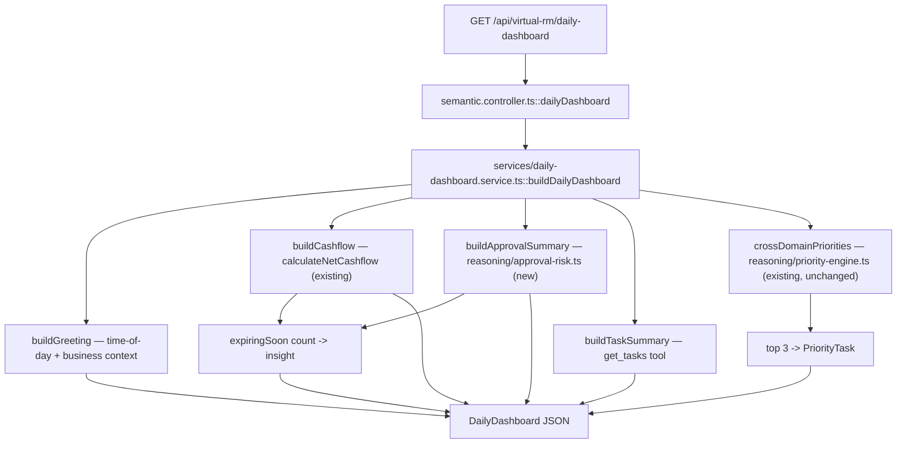

# Phase 5.5 BRD Alignment — Daily Dashboard

Implements `docs/phase-5.5-brd-gap-analysis.md` §4 item 1 (P0). The first of the BRD's four
capability areas built in this pass — see `docs/phase-5.5-brd-alignment.md` for overall status.

## Why a rebuild, not an extension

The gap analysis (§3.5) found the Daily Dashboard's actual data source
(`RmDataService.loadAll()` → `GET /api/rm/briefing`) was a pre-Semantic-Engine legacy path
(`rm.service.ts`/`rules/intent-engine.ts`), completely disconnected from the Reasoning/Risk/
Priority/Verification Engine the chat path already has. Extending that legacy path would mean
re-implementing ranking/risk logic the Priority Engine already does correctly. Instead, this is a
new endpoint built directly on existing Phase 5.5 (Advanced Reasoning) primitives — zero new
ranking logic, only new composition and two new small calculation modules.

## Architecture



Same "standing summary, not a chat answer" relationship `businessBriefing()`/
`tradeFinanceBriefing()` already have to the Reasoning Engine (composes tools/engines directly,
never goes through the Model Router or `runReasoning()`).

## New pieces

- `server/src/reasoning/approval-risk.ts` — `calculateApprovalAge`, `calculateExpiryRisk`,
  `rankPendingApprovals`. No explicit approval-deadline field exists in this demo's
  `PaymentOrder`/`ApprovalRecord` model, so a 30-day expiry window with a 5-day warning threshold
  is used — sized to exactly reproduce the BRD's own worked example (§9: 28 days pending → "sắp
  hết hạn"; 2 days pending → not flagged).
- `server/src/services/daily-dashboard.service.ts` — `buildDailyDashboard()`, composing the
  above plus the existing `crossDomainPriorities()` (Priority Engine, unchanged) and
  `calculateNetCashflow()` (Calculation Engine, unchanged).
- `reasoning/priority-engine.ts` gained two exported constants, `ENTITY_NAV_TARGET`/
  `ENTITY_SCOPED_NAV_TYPES` — extracted from what was an inline map duplicated inside
  `reasoning-engine.ts`'s `DAILY_PRIORITY` chat use case, now shared by both that use case and
  this new endpoint so the navigation-target mapping can't drift between the two.
- `reasoning-types.ts`'s `ReasoningType` gained `PRIORITIZATION`/`TRANSACTION_ASSISTANCE`/
  `DOCUMENT_ANALYSIS` (BRD §5); `DAILY_PRIORITY`'s own type was reclassified from `ADVISORY` to
  `PRIORITIZATION` — it's the BRD's own named example for that type.
- Two seed-data additions (`server/data-seed/payment-orders.json` + `approvals.json`, copied to
  `server/data/`): a payroll payment order pending ~26 days, specifically so the live demo can
  show a real `expiringSoon` warning rather than only exercising that code path in a unit test.

## Response shape (spec §6)

```ts
interface DailyDashboard {
  greeting: { timeOfDay: 'MORNING' | 'AFTERNOON' | 'EVENING'; message: string };
  cashflow: { period: 'TODAY'; currentBalance: number; totalIncoming: number; totalOutgoing: number; net: number; insight: string };
  pendingApprovals: { count: number; totalAmount: number; items: RankedApproval[] };
  tasks: { openCount: number; items: Task[] };
  urgentItems: PriorityTask[];   // top 3, from crossDomainPriorities()
  insights: { message: string }[];
  navigation: NavigationAction[];
}
```

## Greeting personalization — a deliberate deviation from the BRD's literal example

The BRD's worked example greets a person by name ("Chào buổi sáng, anh Minh"). This demo's user
model has no per-user display name (login is by role — `msb_mk`/`msb_ck`/`msb_ad` — not by
person), and the `Customer` record only has a company name and the *bank's* RM contact name, not
the logged-in person's. Fabricating a name would violate the no-hallucination principle this
entire codebase has held since the Semantic Pack — so the greeting personalizes with the company
name instead (`companyName`), the same convention the legacy `buildGreeting()`/`BriefingCardComponent`
already used. Time-of-day and business-context summarization (the BRD's actual functional ask)
are both implemented for real.

## Frontend

- `src/app/core/models/daily-dashboard.model.ts` + `src/app/core/services/daily-dashboard.service.ts`
  — same signals-loaded-once pattern as `TradeFinanceService`.
- Three new card components (`daily-greeting`, `pending-approvals`, `urgent-items`) added to
  `/virtual-rm` (`virtual-rm-dashboard.page.ts`), inserted above the existing Tasks/Alerts/
  Recommendations cards, which are **unchanged** — same MSB design system (`.card`, `app-badge`),
  no new visual language.
- **Deliberately not touched**: `rm-widget.component.ts`'s small floating-panel teaser (still
  reads the legacy `RmDataService`/`/api/rm/briefing` — see gap analysis §3.6). The BRD's Daily
  Dashboard demo (§41 Demo 1) says "Open: Virtual RM", which this repo's `/virtual-rm` full page
  already is; rebuilding the small chat-widget teaser too was judged unnecessary scope for this
  pass and is flagged as a candidate cleanup in `docs/phase-5.5-brd-alignment.md`.

## Verified live

Screenshot captured via Playwright (login → `/virtual-rm`) shows: a time-of-day-correct greeting
mentioning real counts, a cashflow card with a real insight sentence, a "Hôm nay anh/chị nên ưu
tiên" card with 3 ranked items and reasons, and a pending-approvals card correctly flagging the
seeded 26-day-old payroll approval as "🔴 ... ⚠️ Sắp hết hạn duyệt (còn 4 ngày)" — matching the
BRD's own worked example almost exactly.

## Tests

`server/test/daily-dashboard.test.ts` — 30 tests (15 for `buildDailyDashboard()`'s composed
shape, 15 for the approval age/expiry-risk calculations, including the two literal BRD example
values: 28 days → flagged, 2 days → not flagged).
