# Phase 5.5 — Reasoning Architecture & Data Flow

## Full request lifecycle

```mermaid
flowchart TD
    Q[User question] --> SE[Semantic Engine<br/>intent-detector / entity-extractor]
    SE -->|resolved intent, confidence| MR{Model Router<br/>routeQuery deterministic rules}
    MR -->|reasoningRequired=false| RG[response-generator.ts<br/>SIMPLE deterministic answer]
    RG --> RESP[SemanticQueryResult]

    MR -->|reasoningRequired=true, useCase| QP[Query Planner<br/>buildReasoningPlan]
    QP -->|steps.length > AI_MAX_STEPS| REFUSE["Câu hỏi quá phức tạp"<br/>refused before any tool call]
    QP -->|within budget| RE[Reasoning Engine switch<br/>per-use-case case]

    RE --> TL[Tool Layer<br/>server-side UserContext only]
    TL --> CE[Calculation Engine]
    TL --> RiskE[Risk Engine<br/>config/risk-rules.json]
    RiskE --> PE[Priority Engine<br/>cross-domain]
    CE --> EE[Evidence Engine<br/>ReasoningEvidence list]
    RiskE --> EE
    PE --> EE

    CE --> AI[AI Provider .reason&#40;facts&#41;<br/>MockReasoningProvider — phrases only]
    AI --> ANSWER[SemanticAnswer draft]
    EE --> VE{Verification Engine<br/>verifyReasoning}
    ANSWER --> VE

    VE -->|valid| FINAL[finalize&#40;&#41;<br/>tag reasoningType / complexity / verificationStatus]
    VE -->|errors| FALLBACK[safeFallbackAnswer&#40;&#41;]
    FALLBACK --> FINAL
    FINAL --> RESP
    REFUSE --> RESP
```

## Component responsibilities

| Component | File | Responsibility | Phase |
|---|---|---|---|
| Semantic Engine | `semantic/semantic-engine.ts` | Intent detection, entity extraction, deterministic SIMPLE answers | 1–5 |
| Model Router | `ai/model-router.ts` | Decides reasoningRequired + which use case, purely by deterministic keyword rules — never an LLM call | 5, extended 5.5 |
| Query Planner | `reasoning/query-planner.ts` | Declares each use case's `objective`/`steps`/`constraints`; single source of truth for tool-call order and the `AI_MAX_STEPS` check | 5.5 (formalizes Phase 5's inline `PLANS` map) |
| Complexity Classifier | `reasoning/complexity-classifier.ts` | Tags SIMPLE/MODERATE/COMPLEX and the ReasoningType (LOOKUP/AGGREGATION/COMPARISON/DIAGNOSTIC/ADVISORY) | 5.5 |
| Tool Layer | `tools/index.ts` | Security-scoped repository reads; every call takes server-derived `UserContext` | 5, unchanged |
| Calculation Engine | `calculation/financial-calculations.ts` | Deterministic arithmetic (net cashflow, liquidity gap, cash buffer, urgency ranking) | 5/6, unchanged |
| Risk Engine | `reasoning/risk-engine.ts` | Configurable weighted 0–100 score + 4-band level (LOW/MEDIUM/HIGH/CRITICAL) for LC/Guarantee/Collection | 5.5 |
| Priority Engine | `reasoning/priority-engine.ts` | Cross-domain ranking (Task/Approval/Payable/LC/Guarantee/Collection) built on the Risk Engine | 5.5 |
| Evidence Engine | `reasoning/evidence-engine.ts` | Flattens the facts a use case actually used into a traceable `{source, entityType, entityId, field, value}` list | 5.5 |
| AI Provider | `ai/mock-reasoning-provider.ts` | Phrases already-computed facts into Vietnamese RM-style text — never computes | 5, 2 new templates in 5.5 |
| Verification Engine | `reasoning/verification-engine.ts` | Mandatory gate: data exists, no fabricated metric, navigation entities traceable, recommendation supported | 5.5 |
| `finalize()` | `ai/reasoning-engine.ts` | Single choke point every use case's return path goes through — classification + verification can never be skipped for a new use case | 5.5 |

## Why verification sits after the AI Provider, not before

The AI Provider only phrases; it cannot introduce a *new* fact, only a wording of one already in
`facts`. Verification therefore checks the *shape* of the final answer (summary present, metrics
well-formed, navigation entities real) rather than re-deriving the numbers — re-deriving them
would just be running the Calculation/Risk/Priority Engines a second time, which is already
guaranteed deterministic by construction (same input, same output, no randomness anywhere in
this pipeline; see the priority-engine test "scores are deterministic — calling
crossDomainPriorities twice on the same input gives identical results").

## Why the Query Planner still lives next to the Reasoning Engine, not the Model Router

The Model Router decides *whether* and *which* use case — a cheap, synchronous, keyword-only
decision (spec §6: never call the reasoning model to decide). The Query Planner then declares
*how* that use case executes (which tools, in what order, whether the plan is small enough to
run at all). Keeping the plan next to the Reasoning Engine (both under conceptually "how to
answer", not "whether to answer") means a new use case only has to be registered in two places —
`model-router.ts`'s keyword rule and `query-planner.ts`'s `PLAN_DEFS` entry — not three.
