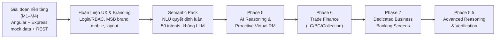

# Virtual RM — Tổng kết các Phase & Thiết kế qua từng giai đoạn

Tài liệu tổng hợp toàn bộ quá trình phát triển Virtual RM, từ bản demo Angular/Express đơn giản
ban đầu đến một **AI-powered Business Reasoning RM** tích hợp sâu vào MSB Business Banking. Mỗi
phần dưới đây nêu: mục tiêu, kiến trúc/thành phần chính được thêm, và **điểm nâng cấp cụ thể so
với phase trước**. Tham chiếu tài liệu chi tiết của từng phase nằm trong `docs/phase-*.md`.

## Sơ đồ tiến hóa tổng quan

Mỗi mũi tên là một **nâng cấp cộng dồn** — phase sau không thay thế phase trước, mà xây thêm một
tầng năng lực mới trên kiến trúc đã có, đồng thời giữ nguyên hành vi của mọi phase trước đó (xác
nhận bằng bộ test hồi quy chạy lại sau mỗi phase).

---

## Giai đoạn nền tảng (M1–M4) — Digital Business Banking Demo Platform

**Mục tiêu:** Dựng khung ứng dụng Business Banking demo hoàn chỉnh: đăng nhập, dashboard, tài
khoản, thanh toán, phê duyệt, sản phẩm, và trợ lý chat cơ bản.

**Thành phần chính:**
- Angular standalone frontend + Express/TypeScript backend, dữ liệu mock dạng JSON file
  (`server/data-seed/*.json` → `server/data/*.json`, có thể reset).
- M1: Scaffold + REST API cơ bản (accounts, transactions, tasks, alerts, products).
- M2: Virtual RM Dashboard (briefing, cảnh báo, việc cần làm, gợi ý sản phẩm).
- M3: Luồng nghiệp vụ tương tác + "Ask Your Bank" chat MVP — dùng bộ luật đơn giản
  (`server/src/rules/intent-engine.ts`), chưa có NLU thật.
- M4: Admin Demo Data Editor, Demo Mode, hoàn thiện UX, README.

**Đặc điểm kiến trúc:** Chat trả lời theo keyword-matching thô sơ, không có khái niệm
intent/entity/confidence. Đây là nền móng — mọi phase sau đều build trên bộ REST API và mock
data này.

## Hoàn thiện UX & Thương hiệu

**Mục tiêu:** Biến bản demo kỹ thuật thành trải nghiệm giống ngân hàng thật.

**Nâng cấp so với giai đoạn nền tảng:**
- Đăng nhập + phân quyền Maker/Checker/Admin (trước đó không có xác thực).
- Theme màu MSB (cam/đỏ) thay cho theme mặc định.
- Virtual RM chuyển từ persona "Mai" sang nhân vật chung "Virtual RM"; icon nổi kéo-thả được.
- Sửa hàng loạt lỗi UX: chat sheet mobile (dvh unit, không bị Safari toolbar che input), active
  tab bleed, approve/reject thực sự chuyển tiền (trước đó chỉ đổi trạng thái UI).
- Mở rộng sidebar, thêm trang landing trước đăng nhập, chuẩn hoá design system
  (`docs/msb-design-system.md`).

**Đặc điểm:** Vẫn dùng bộ luật chat cũ — nâng cấp này là về **trải nghiệm**, chưa phải về **trí
tuệ** của Virtual RM.

## Business Banking Semantic Pack — nền tảng NLU quyết định luận

**Mục tiêu:** Thay bộ luật keyword-matching thô sơ bằng một pipeline NLU thật, vẫn hoàn toàn
**deterministic** (không LLM, không mạng ngoài) — điều kiện tiên quyết để mọi phase AI sau này
có nền tảng đáng tin cậy.

**Thành phần chính (`/business-semantics/*.json` + `server/src/semantic/*.ts`):**
- 13 domain, 30 entity, **50 intent**, ~432 từ đồng nghĩa tiếng Việt.
- Pipeline: `normalizer → date-resolver / amount-parser / status-resolver / entity-extractor →
  intent-detector (chấm điểm 50 intent) → query-builder → response-generator`.
- `confidenceThreshold` (0.65) — dưới ngưỡng thì hỏi lại làm rõ, không đoán bừa
  (`neverHallucinate: true` trong chính sách clarification).
- `npm run validate:semantic` kiểm tra tính toàn vẹn của toàn bộ pack.

**Nâng cấp so với giai đoạn trước:** Từ "khớp từ khóa" sang "hiểu câu hỏi có cấu trúc" — intent +
entity + confidence + filters, đặt nền cho `companyId`/`userId` luôn được server tiêm vào (không
bao giờ lấy từ input người dùng) — nguyên tắc bảo mật xuyên suốt mọi phase sau.

## Phase 5 — AI Reasoning & Proactive Virtual RM

📄 `docs/phase-5-architecture.md`, `phase-5-analysis.md`, `phase-5-evaluation.md`

**Mục tiêu:** Virtual RM không chỉ *tra cứu* mà còn *phân tích* — dòng tiền, thanh khoản, ưu
tiên xử lý — và **chủ động đề xuất**, không chờ được hỏi đúng câu.

**Thành phần chính:**
- `AIProvider` abstraction (`ai/types.ts`) — độc lập nhà cung cấp mô hình.
- `Model Router` (`ai/model-router.ts`) — luật deterministic quyết định câu hỏi có cần
  "reasoning" hay dùng thẳng Semantic Engine (không gọi mô hình cho mọi câu hỏi).
- `Tool Layer` (`server/src/tools/`) — wrapper an toàn quanh repository, luôn nhận
  `UserContext` từ server, không nhận `companyId` từ client.
- `Calculation Engine` (`calculation/financial-calculations.ts`) — công thức tài chính xác định
  (net cashflow, liquidity gap, cash buffer, xếp hạng ưu tiên theo urgency).
- `Reasoning Engine` (`ai/reasoning-engine.ts`) — plan → tool calls → calculate → phrase; giới
  hạn `AI_MAX_STEPS` chống lặp vô hạn.
- `MockReasoningProvider` — phrase template tiếng Việt, không có API key vẫn chạy được (nguyên
  tắc: hệ thống không được "chặn" chỉ vì chưa có provider thật).
- Conversation context (bộ nhớ ngắn hạn theo `userId`) cho câu hỏi nối tiếp.

**Nâng cấp so với Semantic Pack:** Từ "trả lời 1 câu hỏi độc lập" sang "lập kế hoạch nhiều bước,
tính toán, và giải thích" — nhưng **mô hình AI không bao giờ tự tính số** (mock provider chỉ
diễn giải số đã tính sẵn), giữ nguyên tắc no-hallucination đã đặt ra từ Semantic Pack.

## Phase 6 — Trade Finance (LC / Bảo lãnh / Nhờ thu)

📄 `docs/phase-6-trade-finance-architecture.md`, `phase-6-architecture.md`, `phase-6-evaluation.md`

**Mục tiêu:** Mở rộng Virtual RM sang nghiệp vụ Trade Finance — vốn cần dữ liệu và luồng suy luận
riêng (chứng từ, sai biệt, tu chỉnh, claim) mà 50 intent gốc chưa đủ sâu.

**Thành phần chính:**
- Mô hình dữ liệu LC/Guarantee/Collection phong phú hơn: `documents[]`, `discrepancies[]`,
  `amendments[]`, `claims[]`, `riskFlags[]` — nhúng trực tiếp vào record thay vì tách file riêng
  (tránh dữ liệu mồ côi).
- Intent mới cho tra cứu đơn lẻ (document checklist, discrepancy list, claim list...).
- 6 reasoning use case mới trong Reasoning Engine: `LC_RISK_PRIORITIZATION`,
  `GUARANTEE_RISK_PRIORITIZATION`, `TRADE_FINANCE_EXPOSURE`, `TRADE_FINANCE_LIMIT_ANALYSIS`,
  `TRADE_FINANCE_OVERVIEW`, `TRADE_FINANCE_ATTENTION` — tái dùng nguyên xi kiến trúc
  plan→tool→calculate→phrase của Phase 5, không xây lại.
- Điểm rủi ro LC/Guarantee dạng 3 mức (HIGH/MEDIUM/LOW), tính từ shipment/expiry/discrepancy/
  document gaps — công thức cộng điểm đơn giản, **chưa có config file hay trọng số điều chỉnh
  được** (khoảng trống mà Phase 5.5 lấp sau này).
- Trade Finance Briefing endpoint riêng, theo đúng pattern của Business Briefing đã có.

**Nâng cấp so với Phase 5:** Từ "reasoning một domain" (dòng tiền, thanh khoản) sang "reasoning
đa nghiệp vụ mới" (Trade Finance) — chứng minh kiến trúc Phase 5 (plan/tool/calc/phrase) tái sử
dụng được cho một domain hoàn toàn khác mà không cần viết lại.

## Phase 7 — Màn hình Business Banking chuyên biệt cho Trade Finance

📄 `docs/phase-7-trade-finance-dedicated-screens.md`

**Mục tiêu:** Sửa một khoảng trống UX quan trọng — Trade Finance của Phase 6 chỉ trả lời qua
chat, mọi CTA đều trỏ về `/products` chung chung. Virtual RM phải **điều hướng** vào màn hình
nghiệp vụ thật, không thay thế màn hình đó.

**Thành phần chính:**
- REST API mới (`/api/trade-finance/*`) — cùng một nguồn dữ liệu với chat, không phải hệ thống
  song song.
- `SemanticAnswer.action`/`actions[]` được bổ sung `entityId`/`entityType` — 1 câu trả lời có
  thể có nhiều CTA trỏ đến từng bản ghi cụ thể, thay vì 1 link chung.
- 10 route Angular mới: Trade Finance Dashboard, danh sách/chi tiết/tạo mới cho LC, Bảo lãnh,
  Nhờ thu — tái dùng nguyên design system hiện có (không phải giao diện chatbot).
- Deep-link theo fragment (`#documents`, `#discrepancy`...) để CTA từ chat nhảy thẳng vào đúng
  section của trang chi tiết.
- Nguyên tắc con người quyết định giữ nguyên trong UI: mọi nút hành động chỉ "yêu cầu"/"nháp",
  không bao giờ tự động duyệt/phát hành/settle.

**Nâng cấp so với Phase 6:** Từ "Trade Finance chỉ sống trong chat" sang "Virtual RM = tầng
tương tác + trí tuệ, Business Banking screens = tầng thông tin + giao dịch" — đúng tinh thần
kiến trúc mà Phase 5.5 sau này tiếp tục tuân thủ khi trả về `navigation`/CTA thay vì nội dung
đầy đủ trong chat.

## Phase 5.5 — Advanced Business Reasoning & Verification

📄 `docs/phase-5.5-audit.md`, `advanced-reasoning.md`, `reasoning-architecture.md`,
`query-planner.md`, `risk-engine.md`, `verification.md`, `demo-script.md`, `evaluation.md`

**Mục tiêu:** Nâng Virtual RM từ "trợ lý truy vấn + reasoning" (Phase 5/6) thành một **Business
Reasoning RM** thật sự: hiểu câu hỏi → lập kế hoạch → truy xuất → tính toán → suy luận → đánh giá
rủi ro/ưu tiên → thu thập bằng chứng → **xác minh** → giải thích → khuyến nghị → điều hướng.

**Thành phần chính (đều là lớp bổ sung — `server/src/reasoning/`):**
- `Complexity Classifier` — gắn nhãn SIMPLE/MODERATE/COMPLEX và
  LOOKUP/AGGREGATION/COMPARISON/DIAGNOSTIC/ADVISORY cho mọi use case.
- `Query Planner` — chính thức hoá kế hoạch (trước đây là 1 map ẩn trong reasoning-engine.ts)
  thành `{objective, steps, constraints}`, vẫn giữ giới hạn `AI_MAX_STEPS`.
- `Risk Engine` (`config/risk-rules.json`) — điểm rủi ro 0–100 có **trọng số cấu hình được**,
  4 mức LOW/MEDIUM/HIGH/CRITICAL — nâng cấp trực tiếp từ mô hình 3 mức cứng của Phase 6 (giữ
  song song, không phá vỡ Phase 6).
- `Priority Engine` — xếp hạng ưu tiên **xuyên domain** (Task + Approval + Payable + LC +
  Guarantee + Collection cùng một danh sách) — điều Phase 6 chưa làm được (chỉ xếp hạng trong
  nội bộ Trade Finance).
- `Evidence Engine` + `Verification Engine` — mọi câu trả lời reasoning giờ có danh sách bằng
  chứng truy vết được và phải qua một lớp xác minh bắt buộc trước khi trả về người dùng; câu trả
  lời không qua được xác minh sẽ bị thay bằng thông báo an toàn thay vì hiển thị sai.
- 2 use case reasoning mới: `CASHFLOW_DIAGNOSTIC` (DIAGNOSTIC — "Tại sao dòng tiền giảm?") và
  `DAILY_PRIORITY` (ADVISORY xuyên domain — "Việc gì quan trọng nhất hôm nay?").
- API response có thêm `reasoningMeta` (luôn hiển thị, không cần debug mode) — người dùng/hệ
  thống giờ biết được độ phức tạp và trạng thái xác minh của từng câu trả lời.

**Nâng cấp so với Phase 5/6:** Từ "trả lời đã được tính đúng" (tin tưởng ngầm) sang "trả lời đã
được tính đúng **và đã được xác minh**" — đây là khác biệt cốt lõi giữa một trợ lý phân tích và
một hệ thống Business Reasoning đáng tin cậy để đưa vào sản phẩm ngân hàng thật.

---

## Bảng so sánh nâng cấp qua các phase

| Phase | Câu hỏi Virtual RM trả lời được | Cách trả lời | Giới hạn còn lại |
|---|---|---|---|
| M1–M4 | "Cho tôi xem thanh toán" (điều hướng) | Keyword matching thô | Không hiểu câu hỏi tự nhiên |
| Semantic Pack | "Số dư tài khoản USD là bao nhiêu?" | 50 intent, tra cứu 1 bước | Không tính toán/suy luận đa bước |
| Phase 5 | "Dòng tiền tháng này thế nào?" | Plan → Tool → Calculate → Phrase | Chỉ 1 domain (dòng tiền/thanh khoản) mỗi câu hỏi |
| Phase 6 | "LC nào rủi ro cao nhất?" | Reasoning Engine áp dụng cho Trade Finance | Chat là nơi duy nhất xem chi tiết |
| Phase 7 | (như Phase 6) + điều hướng đúng bản ghi | CTA có `entityId` → màn hình chuyên biệt | Điểm rủi ro vẫn 3 mức, không cấu hình được |
| Phase 5.5 | "Việc gì quan trọng nhất hôm nay?" (xuyên domain) + "Tại sao dòng tiền giảm?" | Có phân loại độ phức tạp + **xác minh bắt buộc** trước khi trả lời | Provider AI thật chưa nối (vẫn dùng Mock, có chủ đích) |

## Nguyên tắc xuyên suốt không đổi qua mọi phase

1. **Không hallucination** — mọi số liệu đều truy vết được về dữ liệu mock hoặc một phép tính
   xác định; giữ nguyên từ Semantic Pack đến Phase 5.5.
2. **Mô hình AI không tự tính số** — chỉ diễn giải facts đã tính sẵn (đúng ở cả Mock provider
   Phase 5 lẫn Verification Engine Phase 5.5).
3. **companyId/userId/role luôn từ server** — không có tham số nào cho phép client ghi đè, xác
   nhận lại ở mọi phase bằng bộ test bảo mật riêng.
4. **Virtual RM là tầng tương tác + trí tuệ, không thay thế màn hình nghiệp vụ** — rõ nhất ở
   Phase 7, nhưng là triết lý xuyên suốt kể từ Phase 5.
5. **Không expose chain-of-thought** — debug mode (`SEMANTIC_DEBUG`) chỉ lộ tên tool/calculation
   đã dùng, không bao giờ lộ suy luận nội bộ của mô hình.
