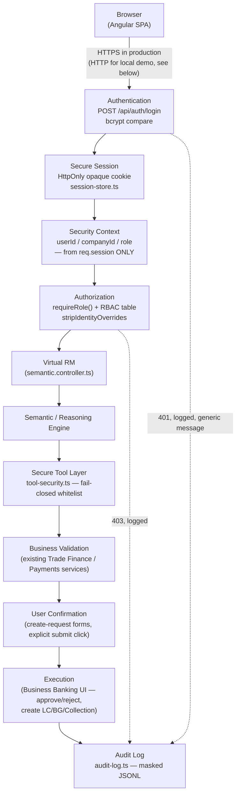

# Authentication

Part of the Login & Session Security upgrade — see `security-gap-analysis.md` for the
before/after and the honest scope decisions behind this pass.

## Security architecture overview

The chain enforced by code, not just this diagram: **AUTHENTICATION → SESSION ESTABLISHMENT →
SESSION VALIDATION → AUTHORIZATION → BUSINESS VALIDATION → USER CONFIRMATION → ACTION EXECUTION
→ AUDIT.** Virtual RM sits *inside* this chain (between Authorization and Business Validation) —
it never sits above or beside it. See `virtual-rm-security.md` for what that means concretely.

## Login flow

`POST /api/auth/login` (`server/src/controllers/auth.controller.ts::login`):

1. `loginRateLimiter` (per-IP, 20 requests / 15 min — see `csrf-cors.md`'s sibling doc,
   `audit-logging.md` for what gets logged on a hit) runs first.
2. Reject with `400` if `username`/`password` are missing or empty — same generic message as a
   real failure (see below), never a field-specific one.
3. `isLocked(username)` — a per-username brute-force lockout independent of the rate limiter
   above (`server/src/auth/rate-limit.ts`), so a distributed attack against one account (many
   IPs, one username) is still caught. Default: 5 failed attempts locks the account for 15
   minutes (`LOGIN_LOCKOUT_THRESHOLD` / `LOGIN_LOCKOUT_MINUTES`).
4. `findUser(username)` + `verifyPassword(password, user.passwordHash)`
   (`server/src/auth/password.ts` — bcrypt via `bcryptjs`, 10 salt rounds). A failed lookup and a
   failed password check are indistinguishable to the caller (see below).
5. On success: `recordSuccessfulLogin` (clears any lockout counter), `createSession(...)` mints a
   **brand-new** opaque session id (see `session-management.md` for fixation protection), sets the
   session cookie + CSRF cookie, logs `LOGIN_SUCCESS`, and returns the session payload (identity +
   expiry — never a password hash or the raw session id).

### Generic errors (spec: never reveal *which* part was wrong)

Every failure path — unknown username, wrong password, locked account — returns the exact same
`401` body: `{ "message": "Thông tin đăng nhập không hợp lệ." }`. Verified by
`server/test/security/login.test.ts`'s "a wrong password for a real user and a nonexistent
username return the exact same message" test. The only exception is a `400` for a structurally
malformed request (missing fields entirely) — still a generic message, just a different status
code for a different class of problem (client didn't send a well-formed request vs. credentials
were wrong).

### Passwords

- Hashed with bcrypt (`bcryptjs`, no native build step needed — this is a Node demo, not a
  compiled binary target), 10 salt rounds, at rest in `server/src/auth/user-store.ts`.
- The old client-side `DEMO_USERS` plaintext map is gone entirely — the frontend never sees a
  password hash, and the backend never compares plaintext strings.
- Virtual RM (and every other part of the app) **never asks for, logs, or stores a password, OTP,
  PIN, or CVV** — see `virtual-rm-security.md`.

### Demo accounts

Unchanged from before this upgrade (same usernames/passwords, now bcrypt-hashed server-side):

| Username | Password | Role |
|---|---|---|
| `msb_mk` | `msb_mk@2026` | MAKER |
| `msb_ck` | `msb_ck@2026` | CHECKER |
| `msb_ad` | `msb_ad@2026` | ADMIN (not advertised on the login screen, still works) |

This is a **demo environment** — no real bank connection, and these are not real customer
credentials. See `transaction-security.md` for how Demo Mode is surfaced to the end user.

## Where identity comes from, from here on

`GET /api/auth/me` is the **only** place the frontend is meant to read `userId`/`companyId`/`role`
from (`src/app/core/services/auth.service.ts::restoreSession()`). It is never read from
localStorage, sessionStorage, a JWT parsed client-side, or a value the frontend itself computed.
See `session-management.md` for the full session lifecycle this endpoint is part of, and
`authorization.md` for how the server enforces this same rule on every other endpoint
(`stripIdentityOverrides`).

## Transport (HTTP vs HTTPS)

This demo's default local deployment runs over plain HTTP (`COOKIE_SECURE=false` — see
`.env.example`), because a `Secure` cookie is silently dropped by the browser over HTTP, which
would break login entirely. A production deployment behind real HTTPS **must** set
`COOKIE_SECURE=true` (and should also flip helmet's HSTS header to `preload`-ready values if it
sits on a stable domain). The CSP's `upgradeInsecureRequests` directive is deliberately **off**
here for the same reason — it would otherwise make the browser silently rewrite every same-origin
API call from `http:` to `https:`, which fails outright against a server with no TLS listener
(confirmed live: every request came back `net::ERR_CONNECTION_RESET` until this was disabled).
